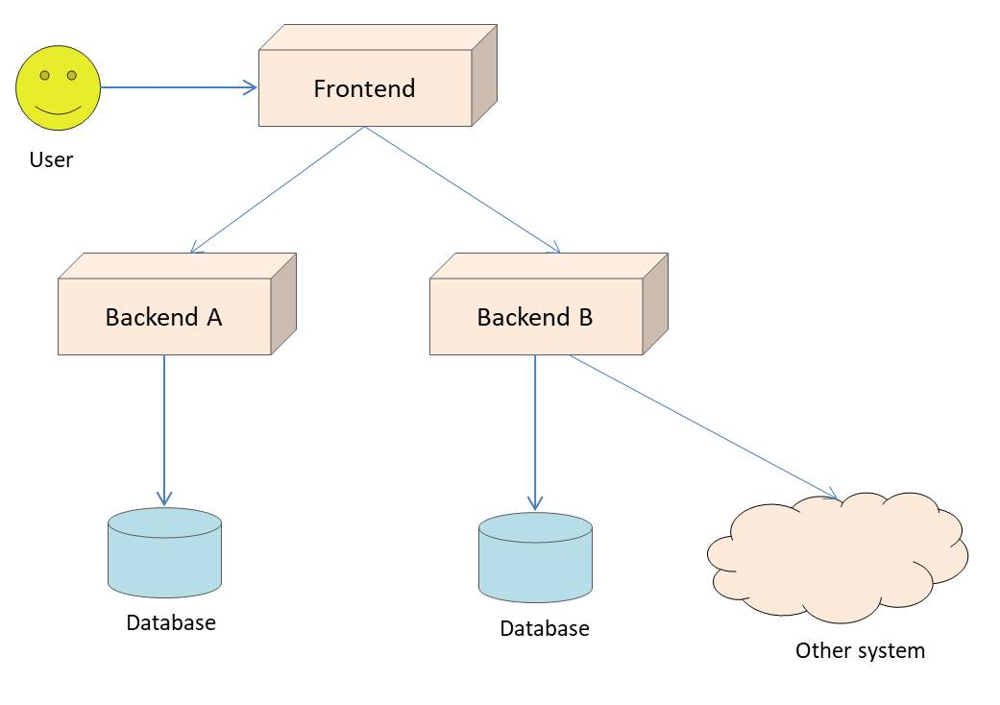
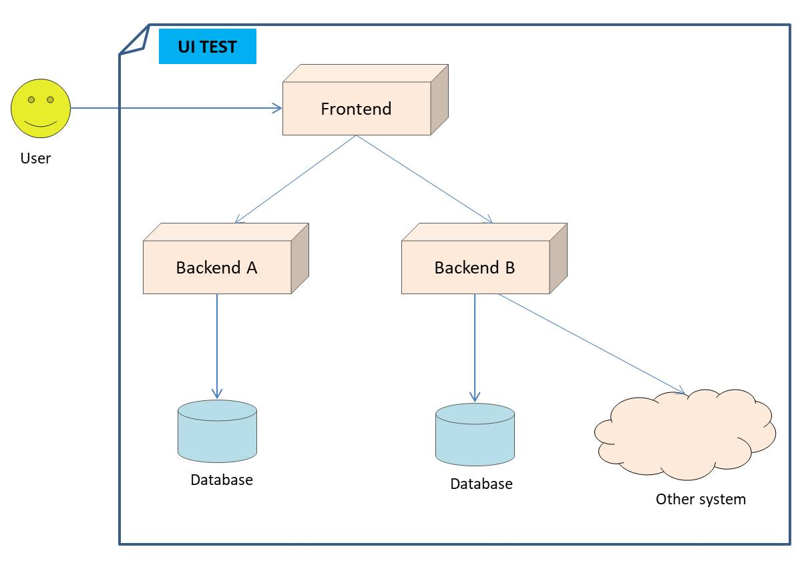
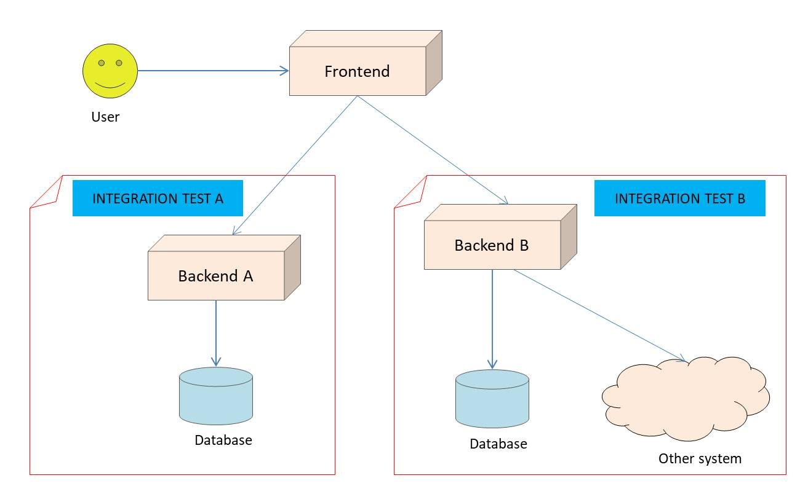
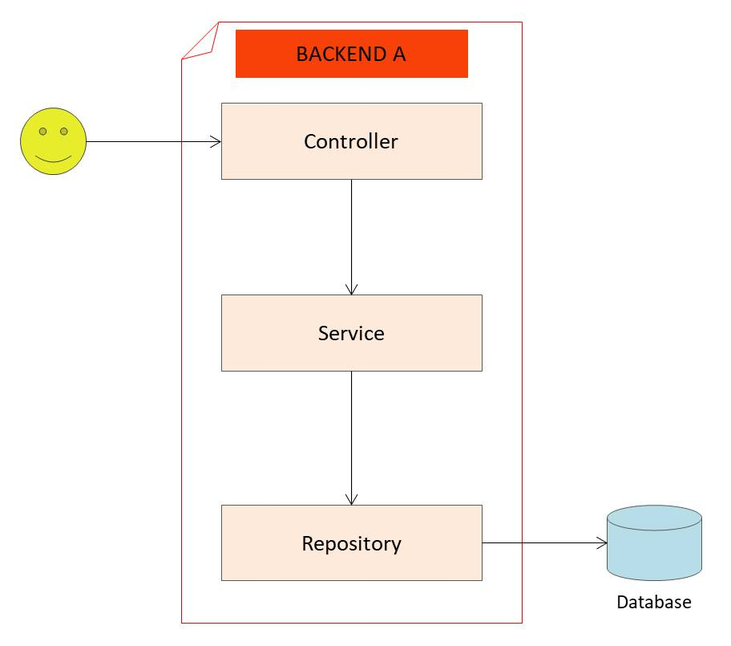
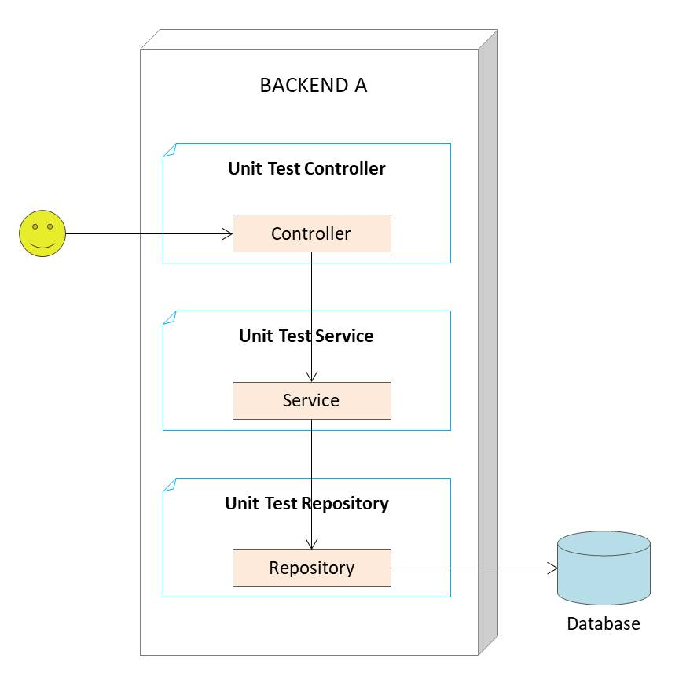

# 8th Path Learning Java : Java Unit Test

# Tools

- Create maven project
  - `mvn archetype:generate`
  - `maven-archetype-quickstart`
- Library JUnit 5

# Pengenalan Software Testing

- Software testing adalah salah satu disiplin ilmu dalam software engineering
- Tujuan utama dari software testing adalah memastikan kualitas kode dan aplikasi kita baik
- Ilmu untuk software testing sendiri sangatlah luas
- Pada materi ini kita hanya akan fokus ke unit testing

# Contoh High Level Architecture Aplikasi

- Berikut diagramnya:

  

# UI Test atau End to End Test

- Berikut diagramnya:

  

- Yang di test beneran semua
- Fokus ngetest nya seakan-akan kita pura-pura jadi user
- Test flow mulai dari depan sampai ke belakang
- Ini paling mahal, karena semua sistem harus berjalan bareng

# Service Test atau Integration Test

- Test lebih ke backend, jadi yang di test langsung backend nya

  

# Contoh Internal Architecture Aplikasi

- Berikut diagramnya:

  

- Aplikasi dibentuk biasanya berlayer-layer

# Unit Test

- Berikut diagramnya:

  

- Unit test akan fokus menguji bagian kode program terkecil, biasanya menguji sebuah method
- Unit test biasanya dibuat kecil dan cepat
- Oleh karena itu biasanya kadang kode unit test lebih banyak dari kode program aslinya, karena semua skenario pengujian akan dicoba di unit test
- Unit test bisa digunakan sebagai cara untuk meningkatkan kualitas kode program kita

# JUnit

- JUnit adalah test framework yang paling populer di Java
- Saat ini versi terbaru JUnit adalah versi 5
- JUnit 5 membutuhkan Java minimal versi 8

# Membuat Test

- Untuk membuat test di JUnit itu sederhana, kita cukup membuat class, lalu menambahkan method-method test nya
- Method akan dianggap sebuah test jika ditambahkan annotation @Test
- Kode test disimpan dibagian test folder di maven, bukan di main folder
- Biasanya saat membuat class untuk test, rata-rata orang biasa membuat nama class nya sama dengan nama class yang akan di test, tetapi diakhiri dengan kata Test
- Misal jika nama class nya adalah Calculator, maka nama class test nya adalah CalculatorTest
